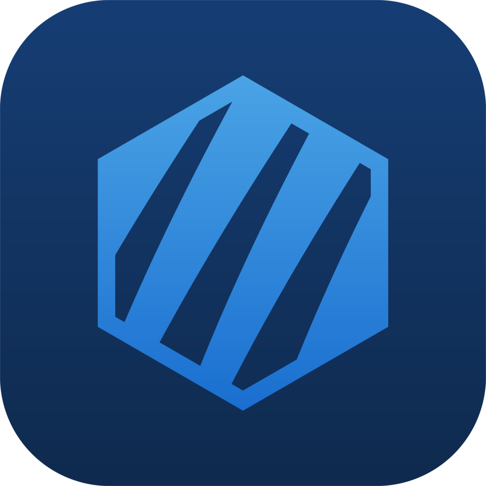

<p align="center">
  
</p>

<h1 align="center">🧊 CryoClaw</h1>

<p align="center">
  <strong>CryoClaw — 基于 openclaw 内核的高效、易用、纯净 harness</strong><br/>
  An efficient, easy-to-use, pure harness built on the <a href="https://github.com/openclaw/openclaw">OpenClaw</a> kernel.<br/>
  一分钟装好，即刻开聊。零配置、零依赖的 OpenClaw 桌面客户端。
</p>

<p align="center">
  <a href="https://github.com/binchen6/CryoClaw/releases/latest"></a>
  <a href="https://github.com/binchen6/CryoClaw/blob/main/LICENSE"></a>
</p>

---

## 🇨🇳 中文

### ✨ 项目简介

CryoClaw 是在 **[OneClaw](https://github.com/oneclaw/oneclaw)**（AGPL-3.0）基础上**二改重构**的 openclaw 桌面 harness：保留了「一分钟装好、开箱即用」的核心体验，对视觉设计、设置架构、执行效率、存储体积与模型管理做了系统性重设计与优化。

这个项目同时是一次 **vibe coding** 实践——全部迭代由人类掌舵需求与验收，通过与多个 AI 编码助手的**多轮协同对话**完成：

| 角色 | 模型 / 工具 | 分工 |
|---|---|---|
| 主力 | **Kimi K3**（Kimi Code） | 架构重设计、核心功能实现 |
| 协同 | **DeepSeek v4 Flash**（Codex） | 代码审查、打包与效率优化 |
| 协同 | **Qwen3.8 Max**（Qoder） | 调试取证、测试与文档 |

> 内核 [OpenClaw](https://github.com/openclaw/openclaw) 源码零改动，CryoClaw 只改桌面壳与打包链路（打包/升级时附带少量幂等兼容补丁：asar 边界、Windows 窗口隐藏、K3 思考档位开放等）。

### 🆚 与 OneClaw 相比

| 维度 | OneClaw | CryoClaw |
|---|---|---|
| 视觉设计 | 原版主题 | 全新冰蓝 TraeWork 设计体系（浅色/暗色双主题、design token + cc-* 原语组件） |
| 更新策略 | 应用自动更新（CDN） | 应用自动更新（GitHub Releases + blockmap 差分下载，设置页可手动检查）+ 内核升级/回退（差分 ASAR 换装）双通道 |
| 设置架构 | 主进程自研读写 IPC | 全面切换内核 `config.get`/`config.patch`（乐观锁 + RFC7396 diff），退役 15+ 自研 IPC |
| 流式渲染 | 逐帧全量 markdown | 逐帧纯文本流式 + 终态一次性排版（消除 O(n²) 卡顿），折叠区懒渲染 |
| 存储体积 | — | gateway.asar 裁剪 279.6 → 226.8MB（非目标平台原生包/冗余类型声明/sourcemap/.pdb 调试符号） |
| 模型管理 | 基础列表 | provider 分组 + 拖拽排序 + 自定义分组 + fallback 链 + 搜索 + 能力徽标（思考/上下文窗口/图像）+ 密钥有效性探测 + 四处选择器联动 |
| 思考强度 | 部分模型被误限为开/关二值 | 按模型能力开放全档位（Kimi K3：low/medium/high/xhigh/max），thinkingLevelMap 正确路由 |
| CLI | `openclaw` PATH 注入 | 额外提供 gateway CLI 托管（127.0.0.1 控制面，`openclaw gateway restart/status` 不再报错） |
| 启动速度 | — | 窗口先行（首屏创建早于同步迁移与扩展 reconcile）+ 内核并行启动 + V8 编译缓存热启动，约 0.6s 看到界面 |
| 插件管理 | 命令行 | 设置页「插件」tab：已安装插件清单 + 启停/卸载 + **ClawHub 插件市场**（搜索/一键安装） |
| 测试 | — | 618 个用例全量回归（vitest + node:test + typecheck），0 fail 为硬指标 |
| 代码质量 | — | jscpd 重复率度量与防回退（全源码重复率 1.01%，阈值 5%，`npm run dupcheck`） |

### 🚀 快速上手

**方式一：安装包（推荐）**

前往 [Releases 页面](https://github.com/binchen6/CryoClaw/releases/latest) 下载 Windows x64 安装包：

```
1️⃣  双击 CryoClaw-Setup-<版本>-x64.exe 安装
2️⃣  选择服务商，输入 API Key
3️⃣  开始对话！
```

不需要装 Node.js，不需要 `npm`，不需要配置任何环境变量。

**方式二：源码构建**

```bash
# 需要 Node.js >= 22.12
git clone https://github.com/binchen6/CryoClaw.git
cd CryoClaw
npm install
npm run dev          # 开发运行（首次会自动下载并打包 openclaw 内核）
npm test             # 全量测试
npm run dist:win     # 打包 Windows x64 安装包 → out/win32-x64/
```

### 🤖 支持的 AI 提供商

Anthropic (Claude) / OpenAI (GPT / Codex) / Google (Gemini) / Moonshot（Kimi）/ DeepSeek / GLM / Qwen / 小米 MiMo / Ollama 本地模型 / 自定义 OpenAI / Anthropic 兼容接口。支持主模型 + fallback 备用链，自动降级时界面有提示；思考强度按各模型能力开放档位（Kimi K3 支持 low/medium/high/xhigh/max）。

### 💬 多渠道集成

飞书 / 企业微信 / 钉钉 / QQ Bot / 微信 —— 设置 → 渠道 中扫码绑定，让 AI 在你的团队 IM 里干活。

### 🏗️ 技术细节

```
CryoClaw (Electron 43 + TypeScript 5.9)
  ├── 主进程壳        src/          IPC 白名单 + sender guard；gateway 子进程托管
  ├── 内核            openclaw 2026.7.1-2（版本 pin，gateway.asar，零改动）
  ├── 聊天界面        chat-ui/      Lit 3 + Vite SPA，file:// 本地加载；图标统一 lucide 风格
  ├── 应用更新器      src/app-updater.ts  electron-updater + GitHub Releases，差分下载、静默换装
  ├── 内核升级器      scripts/updater/  差分 ASAR 换装/回滚 + 冒烟自检
  └── 打包链路        scripts/package-resources.js → electron-builder
```

- **通信**：chat-ui 经 WebSocket RPC 与 gateway 内核通信（内核注册 237 个 RPC 方法）；渲染层 CSP 只允许连接 127.0.0.1。
- **渲染**：markdown 引擎（marked + DOMPurify）支持 GFM 表格/任务列表，样式化的标题与斑马纹表格；代码块带语法高亮（highlight.js 按需加载 15 种常用语言）、语言标签与悬停复制按钮；LaTeX 公式（$$块级$$/$行内$）KaTeX 专业排版；历史消息 `MEDIA:<路径>` 标记渲染为本地图片（点击全屏预览）；LRU 缓存 + 流式旁路防污染，解析异常自动退化为纯文本。
- **消息操作**：任意消息悬停「引用」一键插入 markdown 引用块到输入框；发送失败错误卡片带「重发」按钮，可反复重试。
- **本地文件卡片**：历史消息中的 `MEDIA:<路径>` 标记——图片直接渲染预览，其他常见文件类型（文档/表格/压缩/音视频/代码等）渲染为文件卡片：点击打开、卡片内按钮在文件夹中显示，图标按扩展名区分。
- **子代理等待反馈**：主回合等待子代理期间，聊天区显示子代理状态卡（标题/运行状态/进度摘要），阅读指示器同步切换为「等待子代理返回」。
- **会话回放/分支**：压缩回放点列表（`/compact` 触发），支持回放（rewind）到任意回放点、从回放点分支（fork）出新会话，回放后可直接继续对话。
- **插件管理**：设置页「插件」tab 管理已安装内核插件（启停/卸载），内置 **ClawHub 插件市场**（搜索、一键安装）。
- **快捷键**：Ctrl+N 新建对话、Ctrl+L 聚焦输入框。
- **安全**：全部 IPC 通道过 sender guard；API Key 只存本机（`~/.openclaw/openclaw.json`）；日志统一归集到 `~/.openclaw/logs/` 并脱敏；设置 → 高级 可一键导出**诊断包**（日志 + 环境信息 + 脱敏配置摘要）；open-external 仅放行 http(s)。
- **应用更新**：设置 → 关于 页「应用更新」卡片：启动后静默检查 GitHub Releases，blockmap 差分下载，下载完成后一键「重启更新」（NSIS 静默换装）；失败自动回退全量下载并校验 sha512，不弹窗打扰。
- **稳定性**：渲染进程崩溃自动恢复（60s 滑窗熔断）+ 内存软监控；退出时自动清理临时缓存（保留用户配置与会话历史）。
- **内核升级**：设置页「内核升级」卡片或 `openclaw update` CLI，差分换装、双备份、健康检查失败自动回滚。
- **执行权限**：请求批准 / 智能审批 / 完全同意三态 + Docker 沙箱前置守卫；支持 `update_plan` 计划悬浮面板、目标模式、消息队列、`/` 命令补全。
- **样式体系**：`shared/design-tokens.css`（TraeWork token + 冰蓝 brand-500 `#0EA5E9`）+ `styles/primitives.css` 契约组件，禁止硬编码颜色。
- **测试**：vitest（主进程单测）+ node:test（编译产物/脚本）+ chat-ui typecheck 与单测 + scripts 用例，`npm test` 一键全量（基线 618 pass / 0 fail）。
- **代码质量**：`npm run dupcheck`（jscpd，配置 `.jscpd.json`，阈值 5%）度量全源码重复率，当前 1.01%；公共逻辑集中在渠道面板共享模块、Kimi OAuth 流程、安全打开白名单等共享模块。

详细架构与历史优化记录见 `docs/architecture.md` 与 `docs/OPTIMIZATION-PROGRESS.md`。

### ❓ 常见问题

**Q: 我完全不会编程，可以用吗？**
A: 当然可以！CryoClaw 就是为非技术用户设计的。

**Q: 可以从 OneClaw 迁移过来吗？**
A: 可以。两者共享 `~/.openclaw` 内核数据目录，会话、渠道、凭据无缝继承；OneClaw 的应用配置会在首启时自动迁移。

**Q: Setup 之后可以换 Provider 吗？**
A: 可以。在托盘菜单点「设置」即可修改。

**Q: 应用如何更新？**
A: 双通道：应用本体走 GitHub Releases 自动更新（启动后静默检查，差分下载，设置 → 关于 页可手动检查并「重启更新」）；内核能力演进走内核升级器（可升级、可回滚、有更新日志）。

---

## 🇬🇧 English (Summary)

**CryoClaw** is a fork-and-rebuild of [OneClaw](https://github.com/oneclaw/oneclaw) (AGPL-3.0): an efficient, easy-to-use, pure harness around the [OpenClaw](https://github.com/openclaw/openclaw) kernel. The whole project was iterated via **vibe coding** — multi-round collaborative sessions with Kimi K3 (Kimi Code, lead), DeepSeek v4 Flash (Codex) and Qwen3.8 Max (Qoder), with humans steering requirements and acceptance.

Highlights over OneClaw: ice-blue TraeWork design system (light/dark, lucide-style icons), app auto-update via GitHub Releases with blockmap differential download plus a kernel-only upgrader (diff ASAR swap with rollback), settings fully migrated to kernel `config.get`/`config.patch`, streaming rendered as per-frame plain text (no more O(n²) jank), hardened markdown engine (GFM tables & task lists, code highlighting with language labels, KaTeX math, parse-failure fallback), message quote & error-resend actions, compaction checkpoint rewind/fork, a plugin management page with the ClawHub marketplace, gateway.asar trimmed from 279.6 to 226.8MB, model management with custom groups / drag-reorder / fallback chains / capability badges, per-model thinking levels done right (Kimi K3 low→max instead of a binary toggle), instant /new session reset, managed gateway CLI, ~0.6s startup (early window creation + V8 compile cache), one-click diagnostics bundle export (redacted), renderer crash self-healing, a 618-test regression baseline (0 fail), and a jscpd-tracked code-duplication rate of 1.01% (`npm run dupcheck`, 5% threshold).

Download from [Releases](https://github.com/binchen6/CryoClaw/releases/latest) (Windows x64 installer), or build from source with Node.js ≥ 22.12 (`npm install && npm run dev`).

---

### 🤝 参与贡献 / Contributing

想参与开发？请先阅读 **[CONTRIBUTING.md](CONTRIBUTING.md)**。
Want to contribute? Please read **[CONTRIBUTING.md](CONTRIBUTING.md)** first.

### 🙏 致谢 / Acknowledgements

- [OpenClaw](https://github.com/openclaw/openclaw) — 本项目封装的 agent 内核。
- [OneClaw](https://github.com/oneclaw/oneclaw) — 本项目的上游代码库；CryoClaw 在其基础上更名、重设计并重构（修改说明见上文「与 OneClaw 相比」）。

### 📄 License

GNU Affero General Public License v3.0 (`AGPL-3.0-only`)，与上游 OneClaw 一致。

Commercial use is allowed, but if you modify and distribute this software, or provide a modified version over a network, you must provide the corresponding source code under AGPL v3.
